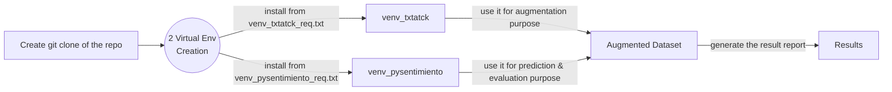

# Welcome to SentimentalDestroR
This repository focuses on the sentiment classification library [**pysentimiento**](https://github.com/pysentimiento/pysentimiento). We intend to demonstrate how the performance of the classifier reduces due to the introduction of augmented sentences.
For the augmentation we use the augmentation recipe EDA, [Easy Data Augmentation](https://arxiv.org/abs/1901.11196) provided by [**TextAttack**](https://textattack.readthedocs.io/en/latest/3recipes/augmenter_recipes.html). As this augmentation recipe provides the best results for variance testing. It uses WordNet synonym replacement, Word deletion, Word order swaps, and, Random synonym insertion, at the same time.
 
# Dataset Description
:open_file_folder: Sentiment Dataset 
For this demonstration we focus on the dataset of [SemEval17 Task 4](https://alt.qcri.org/semeval2017/task4/index.php?id=data-and-tools) which is a very popular dataset for sentiment analysis. 
Folder structure:
```
Sentiment_Dataset
├── SemEval17
│   ├── Augmented
│   │   ├── augmented(20%)_SemEval17.csv   // csv with 20% augmentation 
│   │   ├── augmented_SemEval17.csv		// csv with 50% augmentation
│   │   └── predicted_semeval17.csv		// raw prediction
│   ├── augmented_SemEval17.csv
│   ├── Clean
│   │   └── semeval.csv		// clean dataset with unnececary cols dropped
│   └── Raw
│       ├── 4a-english.zip
│       ├── baseline-A-english.txt
│       ├── README.txt
│       ├── SemEval2017-task4-dev.subtask-A.english.INPUT.txt // actual dataset
│       ├── SemEval2017_task4_test_scorer_subtaskA.pl
│       └── twitter-2016test-A-English.txt
└── Sentiment140
    ├── Augmented
    │   ├── augmented_sentiment140.csv
    │   └── predicted_sentiment140.csv
    ├── Clean
    │   ├── clean_sentiment140.csv
    │   └── sentiment140.csv
    └── Raw
        └── training.1600000.processed.noemoticon.csv
```


## Get the dataset Dataset
First run the dataset.py file to create the dataset folder(Sentiment_Dataset). Or download it from the [link](https://drive.google.com/drive/u/1/folders/1BjzJC6voM8KP3OxyD2LXXkvgAoataW1a).
```
    python dataset.py [-h]          Provides documentation
                      [--help]
                      
                      [--create_database] Creates the "Databases" directory 
                                          in the root directory with all the datasets
``` 

## File Description
|	File Name	|	Usage	|
|--|--|
| :snake: augmentation_SemEval17.ipynb  | Creates the 50% augmented dataset of the SemEval17 Dataset and evaluates it  |
| :snake: augmentation_SemEval17(20%).ipynb | Creates the 50% augmented dataset of the SemEval17 Dataset and evaluates it |
| :snake: augmentation_sentiment140.ipynb | :warning: Creates augmented dataset for Sentiment140 |

:warning: The Sentiment140 Dataset is unusable due to the discrepancy polarity of the dataset and the classifier model. 


## How the pipeline works

## Result 
We can notice significant reduction on the performance of the model for the introduction of the augmented dataset
### Performance Before Augmentation
```python
REPORT
              precision    recall  f1-score   support

         NEG       0.79      0.88      0.83      3231
         NEU       0.88      0.82      0.85     10342
         POS       0.84      0.88      0.86      7059

    accuracy                           0.85     20632
   macro avg       0.84      0.86      0.85     20632
weighted avg       0.85      0.85      0.85     20632

CONFUSION MATRIX
[[2839  373   19]
 [ 699 8480 1163]
 [  34  805 6220]]
```
### Performance After 20% Augmentation
```python
REPORT
              precision    recall  f1-score   support

         NEG       0.73      0.76      0.75      3231
         NEU       0.79      0.83      0.81     10342
         POS       0.84      0.76      0.80      7059

    accuracy                           0.80     20632
   macro avg       0.79      0.78      0.79     20632
weighted avg       0.80      0.80      0.80     20632

CONFUSION MATRIX
[[2465  709   57]
 [ 798 8560  984]
 [  93 1571 5395]]
```
### Performance After 50% Augmentation
```python
REPORT
              precision    recall  f1-score   support

         NEG       0.66      0.61      0.63      3231
         NEU       0.69      0.85      0.76     10342
         POS       0.83      0.57      0.68      7059

    accuracy                           0.72     20632
   macro avg       0.73      0.68      0.69     20632
weighted avg       0.73      0.72      0.71     20632

CONFUSION MATRIX
[[1961 1209   61]
 [ 789 8801  752]
 [ 200 2834 4025]]
```